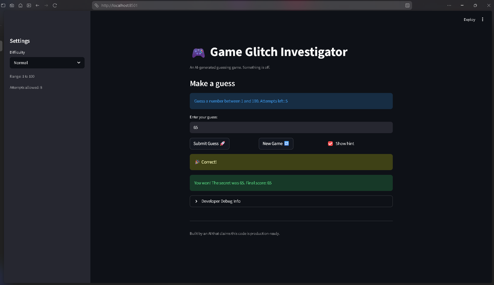

# 🎮 Game Glitch Investigator: The Impossible Guesser

## 🕹️ About the Game

A number guessing game built with Streamlit. Pick a difficulty, guess the secret number within the attempt limit, and rack up points by guessing in as few tries as possible.

- **Easy** — range 1–20, 6 attempts
- **Normal** — range 1–100, 8 attempts
- **Hard** — range 1–500, 5 attempts

Hints tell you whether to guess higher or lower. Score starts at 100 and drops 10 points per attempt, with a 5-point penalty for each wrong guess. Minimum win score is 10.

## 🛠️ Setup

1. Install dependencies: `pip install -r requirements.txt`
2. Run the app: `python -m streamlit run app.py`
3. Run tests: `pytest tests/test_game_logic.py -v`

## 🐛 Bugs Found and Fixed

| Bug | File | Fix |
| --- | --- | --- |
| "New Game" didn't reset `status`, so the game stayed won/lost | `app.py` | Added `st.session_state.status = "playing"` to the New Game handler |
| "New Game" didn't clear `history`, old guesses carried over | `app.py` | Added `st.session_state.history = []` to the New Game handler |
| `attempts` initialized to `1`, making "Attempts left" off by one | `app.py` | Changed initial value to `0` |
| "Attempts left" showed stale count during a submit rerun | `app.py` | Used `st.empty()` placeholder, filled after submit logic runs |
| Debug panel showed pre-submit score/attempts | `app.py` | Moved expander to bottom of script |
| Changing difficulty didn't reset the game | `app.py` | Stored difficulty in session state; reset game when it changes |
| Hard mode range was `1–50` (easier than Normal's `1–100`) | `logic_utils.py` | Changed Hard range to `1–500` |
| Score formula used `attempt_number + 1`, costing an extra 10 pts | `logic_utils.py` | Removed the `+ 1` |

## 📸 Demo

## 🚀 Stretch Features

- [ ] [If you completed Challenge 4, insert a screenshot of your Enhanced Game UI here]
